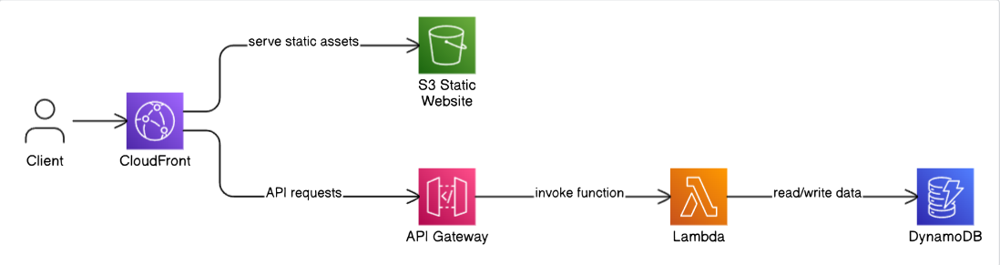

## 🧱 Architecture Overview

The architecture of this serverless web application looks like this:

- **Client** → Sends requests through CloudFront.
- **CloudFront** → Delivers static content from S3 and routes API requests to API Gateway.
- **S3 Static Website** → Hosts the static frontend (HTML, CSS, JS).
- **API Gateway** → Acts as an entry point for backend API requests.
- **Lambda** → Processes logic and interacts with DynamoDB.
- **DynamoDB** → Stores application data in a scalable NoSQL table.
